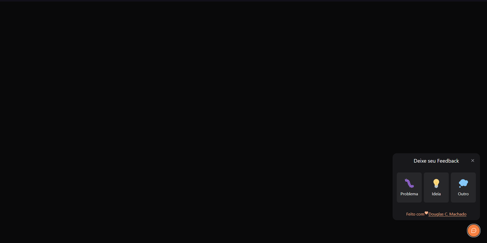

# NLW RETURN WEB



## Projeto  
---

Widget desenvolvido para receber feedbacks sobre o site, podendo até tirar uma print da tela do usuário e receber essas informações na base de dados.
---

## Tecnologias

* React
* Typescript
* Axios
* Tailwind
* Phosphor
* Vite
* Html2Canvas
* HeadlessUI
---

## Features

* Acessibilidade da aplicação
* Escolha do tipo do feedback e envio de uma imagem das tela
---

## Executando o projeto

Utilize `npm install` ou `yarn` para obter as dependências do projeto
```
  npm install
```

Configure sua variável de ambiente de conexão com o back-end

```
  VITE_API_URL=
```

Utilize `npm run dev` ou `yarn dev` para rodar o projeto 
```
  npm run dev
```